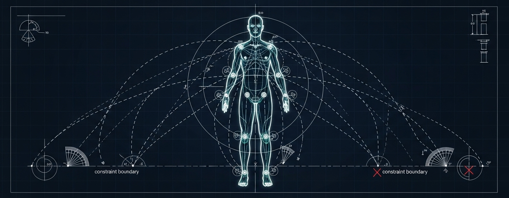

# KineticAugment: A Geometry-Aware Augmentation Framework for Human Motion

<p align="center">
  
</p>

**KineticAugment** is a framework for augmenting human motion data while preserving anatomical and semantic plausibility. It's designed for researchers and engineers working on Sign Language Recognition, Human Activity Recognition, and other motion analysis tasks who need to increase dataset size without introducing unrealistic or label-altering artifacts.

Traditional data augmentation techniques often fail on skeletal time-series data, creating impossible poses and unnatural movements. KineticAugment solves this by treating the human body as a structured kinematic system, governed by a set of core biomechanical and contextual principles.

---

## ✨ Key Features

*   **Anatomically Plausible:** Augmentations respect joint limits, bone lengths, and self-collision constraints.
*   **Kinematically Consistent:** Transformations correctly propagate through the body's kinematic chains.
*   **Temporally Coherent:** Generates smooth motion that respects human dynamics, avoiding unrealistic "teleporting" joints.
*   **Semantically Aware:** A priority system prevents augmentations from changing the fundamental meaning of a motion (e.g., altering a sign or activity label).
*   **Task-Specific Profiles:** Easily configure the augmentation pipeline for different tasks (e.g., SLR, HAR) using simple configuration files.

## 📚 Documentation

The complete documentation provides the theory, architecture, and practical guides for using the framework.

*   **[00 - Introduction](./docs/00_Introduction.md)**: Why KineticAugment? The problem with naive augmentation.
*   **[01 - Core Principles](./docs/01_Core_Principles.md)**: A deep dive into the 6 pillars that govern the framework.
*   **[02 - Framework Architecture](./docs/02_Framework_Architecture.md)**: The layered model: Core Engine, Constraint System, and Task Profiles.
*   **[03 - The Augmentation Catalogue](./docs/03_Augmentation_Catalogue.md)**: A comprehensive list of available augmentation techniques.
*   **[04 - Task-Specific Profiles](./docs/04_Task_Specific_Profiles.md)**: How to tailor augmentations for your specific application.
*   **[05 - The Validation Framework](./docs/05_Validation_Framework.md)**: Ensuring the quality and validity of generated data.
*   **[Glossary](./docs/GLOSSARY.md)**: Definitions of key terms.

## 🚀 Getting Started (Future)

*(This section will contain instructions on how to install and use the Python library once it's developed.)*

```python
# Future usage example
from kinetic_augment import AugmentationPipeline
from kinetic_augment.profiles import load_profile

# 1. Load a pre-defined task profile
slr_profile = load_profile("configs/slr_profile.yaml")

# 2. Create an augmentation pipeline
pipeline = AugmentationPipeline(profile=slr_profile)

# 3. Augment your data
augmented_motion = pipeline.augment(original_motion)

```

## 🤝 Contributing

We welcome contributions from the community! Whether it's adding a new augmentation, improving documentation, or reporting a bug, your help is valued. Please read our **[Contributing Guide](./CONTRIBUTING.md)** to learn how you can get involved.

## 📄 License

This project is licensed under the [MIT License](./LICENSE).