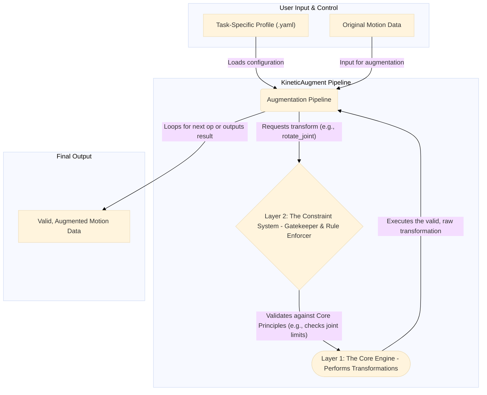

# 02: Framework Architecture

To effectively implement the [Core Principles](./01_Core_Principles.md), KineticAugment is designed with a modular, layered architecture. This design separates the fundamental transformation operations from the rules that govern them, making the framework flexible, extensible, and easy to configure.

The architecture consists of three main layers:
1.  **The Core Augmentation Engine** (The "Muscle")
2.  **The Constraint System** (The "Brain")
3.  **Task-Specific Profiles** (The "Blueprint")

---

### Visualizing the Architecture

The following diagram illustrates how data flows through the framework. A user provides the motion data and a Task Profile, and the pipeline processes it through the layers to produce a valid, augmented sample.



*(This diagram shows the Augmentation Pipeline reading a Profile, then for each step, it attempts to call a function in the Core Engine. The Constraint System intercepts and validates this call before the Engine executes it.)*

---

### Layer 1: The Core Augmentation Engine

The **Core Engine** is the foundation of the framework. It is a library of fundamental, task-agnostic transformation functions that operate on geometric and time-series data.

*   **Role:** To perform the raw mathematical operations for augmentation.
*   **Characteristics:**
    *   **Stateless:** The functions themselves do not store any constraint information.
    *   **Unconstrained:** A function like `rotate_joint(joint, angle)` will perform the rotation regardless of whether the angle is anatomically possible. It is "dumb" on its own.
*   **Example Functions:**
    *   **Geometric:** `rotate_joint()`, `scale_limb()`, `translate_skeleton()`.
    *   **Temporal:** `warp_trajectory()`, `resample_sequence()`, `add_temporal_noise()`.

This layer provides the "verbs" of our augmentation language (e.g., "rotate", "scale", "warp").

### Layer 2: The Constraint System

The **Constraint System** is the intelligent layer that enforces the [Core Principles](./01_Core_Principles.md). It acts as a smart wrapper or gatekeeper around the Core Engine.

*   **Role:** To ensure every transformation is physically, kinematically, and temporally valid.
*   **Characteristics:**
    *   **Stateful:** It holds the rules, such as joint angle limits and limb connectivity information.
    *   **Enforcing:** It intercepts calls to the Core Engine, validates the parameters, and ensures consistency.
*   **Example Actions:**
    *   When the pipeline requests `rotate_joint(elbow, angle=3.0)`, the Constraint System first checks if `3.0` radians is within the valid range for an elbow. If not, it can clamp the value or reject the operation.
    *   After a valid shoulder rotation, it automatically calculates the new positions for the elbow and wrist to maintain **Kinematic Chain Consistency**.
    *   It ensures noise applied to the left arm is appropriately correlated with noise applied to the right arm, upholding **Inter-Limb Coordination**.

This layer provides the "rules" of our augmentation language, turning a potentially chaotic process into a controlled one.

### Layer 3: Task-Specific Profiles

A **Task-Specific Profile** is a human-readable configuration file (e.g., in YAML or JSON format) that tells the augmentation pipeline *what* to do, *how often*, and *with what intensity*. It is the user-facing control panel for the entire framework.

*   **Role:** To define a complete augmentation strategy for a specific application (e.g., SLR or HAR).
*   **Characteristics:**
    *   **Declarative:** The user declares *what* they want, not *how* to implement it.
    *   **Modular:** Different profiles can be created and swapped out for different experiments or datasets.
*   **Example `slr_profile.yaml` Snippet:**

    ```yaml
    # Defines the augmentation strategy for Sign Language Recognition
    augmentation_plan:
      - operation: "rotate_joint"
        joint_group: "spine"
        params:
          max_angle: 0.1 # radians
        probability: 0.7

      - operation: "add_joint_noise"
        joint_group: "fingers"
        # HIGH priority feature, so noise is minimal
        params:
          noise_stddev: 0.005
        probability: 0.3
        # Semantic Integrity Constraint:
        preserve_handshape: True
    ```

This layer provides the "story" or "recipe" that uses the verbs and rules from the other layers to create a meaningful final product.

---

### Next Up: The Augmentation Catalogue

Now that we understand the architecture, we can explore the comprehensive list of "verbs" available in the Core Engine.

➡️ **Next: [03 - The Augmentation Catalogue](./03_Augmentation_Catalogue.md)**
